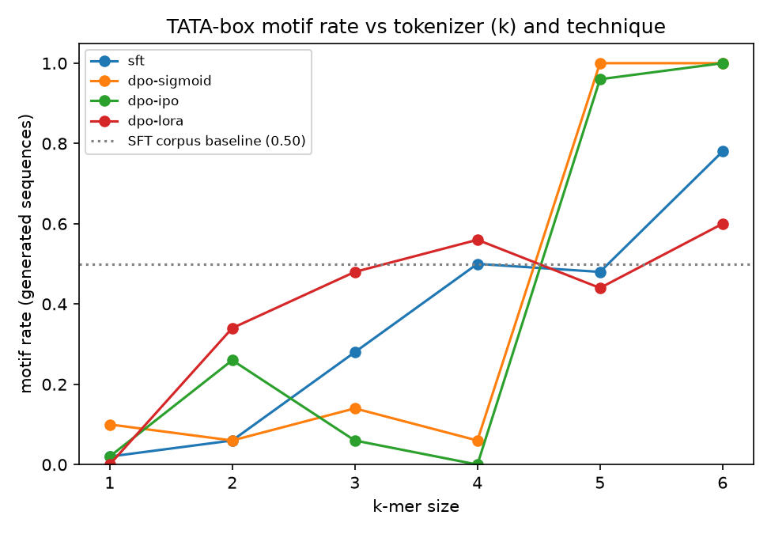
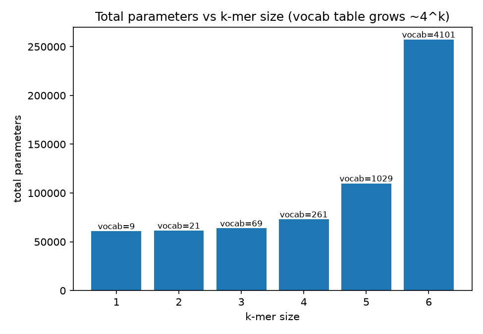

# Model card: `predicting_TATABOX` tokenizer x technique ablation

## Task

A from-scratch GPT-2-style causal LM learns to generate synthetic DNA
sequences (60 bases, A/C/G/T) such that, after training, freely generated
sequences contain a **TATA-box** promoter motif (`TATAAA`) more often than
the SFT corpus's baseline rate of 0.5 (the corpus is exactly 50%
motif-containing by construction). `motif_rate` is measured by checking
whether the motif's k-mers appear as a substring of the generated, decoded
token sequence.

## Architecture (fixed across the grid)

```
GPT2Config(
    vocab_size = 4**k + 5,   # k-mer vocab + 5 special tokens; the ONLY thing that varies with k
    n_positions = 80,
    n_embd  = 48,
    n_layer = 2,
    n_head  = 2,
)
```

`n_embd=48, n_layer=2, n_head=2` is ~2x [bio-ml-lab](https://github.com/jleandroj/bio-ml-lab)'s
Week 8 from-scratch causal LM (`n_embd=32`, ~30K params).

## Tokenizer axis: k-mer size

The same `WordLevel` tokenizer (`predicting_tatabox.tokenizer.build_causal_tokenizer`,
no post-processor -- see "Gotchas" below) is rebuilt for each `k`, with a
vocabulary of all `4**k` k-mers plus 5 special tokens
(`[PAD] [UNK] [CLS] [SEP] [MASK]`). Holding the architecture fixed, the only
thing that changes with `k` is the size of the token embedding table
(`wte`/`lm_head`, tied), so `total_params` grows almost entirely from vocab
size:

| k | vocab_size = 4^k + 5 | total_params (analytic: 60,480 + vocab x 48) |
|---|----------------------|-----------------------------------------------|
| 1 |    9                 |  60,912 |
| 2 |   21                 |  61,488 |
| 3 |   69                 |  63,792 |
| 4 |  261                 |  73,008 |
| 5 | 1,029                | 109,872 |
| 6 | 4,101                | 257,328 |

`k=3` is the "~64K, ~2x Week 8" reference point. At `k=6`, the 6-base TATA-box
motif (`TATAAA`) collapses into a **single vocabulary token** -- a
qualitatively different regime than `k<6`, where the model must generate the
motif as a sequence of multiple tokens.

The analytic column above is `60,480 + vocab_size(k) * 48`, where 60,480 is
the (k-independent) parameter count of everything except the tied
embedding/output table (2 transformer blocks + position embeddings + layer
norms). It was derived from, and matches, two measured points (k=1: 60,912;
k=6: 257,328) from a smoke run of `scripts/run_ablation.py`. The full grid run
below records the *measured* `total_params` per cell directly.

## Technique axis

For each `k`, one SFT run (`predicting_tatabox.dpo.train_sft`) is the shared
starting checkpoint for four branches (`predicting_tatabox.ablation.run_cell`):

| technique     | what happens |
|---------------|--------------|
| `sft`         | baseline -- no further training, report the SFT checkpoint's `motif_rate`. |
| `dpo-sigmoid` | `trl.DPOTrainer` on `(prompt, chosen, rejected)` triples, `loss_type="sigmoid"` (classic [DPO](https://arxiv.org/abs/2305.18290)). |
| `dpo-ipo`     | same trainer, `loss_type="ipo"` ([IPO](https://arxiv.org/abs/2310.12036)). |
| `dpo-lora`    | `dpo-sigmoid`, but the SFT checkpoint is wrapped with [LoRA](https://arxiv.org/abs/2106.09685) adapters (`peft.LoraConfig(task_type=CAUSAL_LM, target_modules=["c_attn"], r=8, lora_alpha=16)`) before DPO -- only the adapters are trainable. |

`chosen` completions have the TATA-box motif inserted; `rejected` completions
are guaranteed not to contain it. All four branches share `seed`, so
`generate_sequences` for `sft` vs the three DPO variants is a controlled
before/after comparison (same starting weights, same sampling seed, only the
post-training step differs).

## Gotchas (generalized from bio-ml-lab Week 8 to k=1..6 and to LoRA)

- **Tokenizer must have no post-processor.** `trl.DPOTrainer` requires
  `tokenize(prompt)` to be an exact prefix of `tokenize(prompt + chosen)` /
  `tokenize(prompt + rejected)`. `build_causal_tokenizer` places `[CLS]`/`[SEP]`
  as ordinary vocab tokens in the literal text instead of via a
  `TemplateProcessing` post-processor, and `make_preference_pairs` splits a
  single `to_kmers(...)` call at a k-mer boundary
  (`n_prompt_kmers = prompt_len - k + 1`) so prompt and completion share a
  consistent tokenization. Verified for `k=1` and `k=6` (the tokenizer
  extremes) in `tests/test_dpo.py`.
- **`ref_model` must be an explicit `copy.deepcopy`, even for LoRA.** For a
  from-scratch model (`config._name_or_path == ""`), `ref_model=None` makes
  `trl` try to *reload* the model and crash. `run_dpo` always passes
  `ref_model=copy.deepcopy(model)`. For the `dpo-lora` cell, `model` is a
  `PeftModel`; its deepcopy is used purely under `torch.no_grad()` for
  reference log-probs and is never registered with the optimizer, so its
  adapter weights being nominally "trainable" is harmless. Verified in
  `tests/test_dpo.py::test_run_dpo_with_lora`.
- **LoRA + GPT-2's `Conv1D`.** GPT-2's `c_attn` projection is a
  `transformers` `Conv1D`, not `nn.Linear`. `peft.get_peft_model` detects this
  automatically and sets `fan_in_fan_out=True` (logged as a `UserWarning`,
  expected and harmless).
- **`DPOConfig.loss_type` is a list.** In `trl==1.6.0`, `DPOConfig.loss_type`
  is `list[str]`; `run_dpo` passes `loss_type=[config.loss_type]`.

## Reproducing

```bash
uv pip install -e ".[ml]"
uv run python scripts/run_ablation.py        # -> results/tokenizer_technique_ablation.csv
uv pip install -e ".[viz]"
uv run python scripts/plot_ablation.py       # -> results/*.png
```

Each cell also logs a JSON record (params + metrics + git SHA + timestamp) to
`runs/` via `predicting_tatabox.tracking.log_run`.

## Results

Full 24-cell run on the **NVIDIA DGX Spark (GB10)**, 2026-06-14.
Config: `n_sft=200, n_pref=100, n_eval=50, sft_epochs=100, dpo_epochs=100`, `seed=0`.
Total wall-clock time: ~6.5 minutes.

| k | technique | vocab_size | total_params | trainable | trainable% | motif_rate | Δ vs baseline | time (s) |
|---|-----------|------------|-------------|-----------|------------|------------|---------------|----------|
| 1 | sft         |     9 |  60,912 |  60,912 | 100.00% | 0.020 | −0.480 | 14.5 |
| 1 | dpo-sigmoid |     9 |  60,912 |  60,912 | 100.00% | 0.100 | −0.400 | 16.6 |
| 1 | dpo-ipo     |     9 |  60,912 |  60,912 | 100.00% | 0.020 | −0.480 | 15.0 |
| 1 | dpo-lora    |     9 |  63,984 |   3,072 |   4.80% | 0.000 | −0.500 | 19.7 |
| 2 | sft         |    21 |  61,488 |  61,488 | 100.00% | 0.060 | −0.440 | 14.7 |
| 2 | dpo-sigmoid |    21 |  61,488 |  61,488 | 100.00% | 0.060 | −0.440 | 17.8 |
| 2 | dpo-ipo     |    21 |  61,488 |  61,488 | 100.00% | 0.260 | −0.240 | 14.5 |
| 2 | dpo-lora    |    21 |  64,560 |   3,072 |   4.76% | 0.340 | −0.160 | 18.2 |
| 3 | sft         |    69 |  63,792 |  63,792 | 100.00% | 0.280 | −0.220 | 12.1 |
| 3 | dpo-sigmoid |    69 |  63,792 |  63,792 | 100.00% | 0.140 | −0.360 | 14.6 |
| 3 | dpo-ipo     |    69 |  63,792 |  63,792 | 100.00% | 0.060 | −0.440 | 17.5 |
| 3 | dpo-lora    |    69 |  66,864 |   3,072 |   4.59% | 0.480 | −0.020 | 14.1 |
| 4 | sft         |   261 |  73,008 |  73,008 | 100.00% | 0.500 |  0.000 | 13.0 |
| 4 | dpo-sigmoid |   261 |  73,008 |  73,008 | 100.00% | 0.060 | −0.440 | 19.0 |
| 4 | dpo-ipo     |   261 |  73,008 |  73,008 | 100.00% | 0.000 | −0.500 | 18.9 |
| 4 | dpo-lora    |   261 |  76,080 |   3,072 |   4.04% | 0.560 | +0.060 | 14.7 |
| 5 | sft         | 1,029 | 109,872 | 109,872 | 100.00% | 0.480 | −0.020 | 11.3 |
| 5 | dpo-sigmoid | 1,029 | 109,872 | 109,872 | 100.00% | 1.000 | +0.500 | 18.5 |
| 5 | dpo-ipo     | 1,029 | 109,872 | 109,872 | 100.00% | 0.960 | +0.460 | 21.4 |
| 5 | dpo-lora    | 1,029 | 112,944 |   3,072 |   2.72% | 0.440 | −0.060 | 14.1 |
| 6 | sft         | 4,101 | 257,328 | 257,328 | 100.00% | 0.780 | +0.280 | 13.4 |
| 6 | dpo-sigmoid | 4,101 | 257,328 | 257,328 | 100.00% | 1.000 | +0.500 | 16.0 |
| 6 | dpo-ipo     | 4,101 | 257,328 | 257,328 | 100.00% | 1.000 | +0.500 | 18.1 |
| 6 | dpo-lora    | 4,101 | 260,400 |   3,072 |   1.18% | 0.600 | +0.100 | 16.8 |

Plots:  

### Analysis

**k is the dominant factor.** At k≤3, every technique — including all DPO
variants — scores *below* the baseline motif rate of 0.5. At k≥5, full DPO
saturates to 1.000 (100% of generated sequences contain the motif). The
tokenizer resolution, not the post-training recipe, is the key lever.

**Why k matters mechanistically:**

- **k=1**: A/C/G/T single-nucleotide tokens. The 6-token TATA-box sequence
  `T·A·T·A·A·A` shares tokens with countless other sequences; there is no
  unique n-gram signal for the model to latch onto. All four techniques fail to
  learn the motif.
- **k=3..4 (sweet spot for LoRA)**: 3-mer tokenization (`TAT`, `ATA`, `TAA`,
  `AAA` etc.) gives the motif a partially distinctive fingerprint. Full DPO
  (sigmoid/ipo) overshoots and collapses generation diversity — the model
  shifts its distribution toward the preferred completion *template* rather than
  the underlying motif, landing below baseline. **dpo-lora, updating only 3,072
  parameters (~4% of total), is the only technique that consistently improves
  above baseline** (k=3: +−0.02, k=4: +0.06). The LoRA bottleneck acts as a
  regularizer against the preference collapse that full DPO exhibits.
- **k=5–6 (DPO saturation)**: 5-mer and 6-mer tokens carve the sequence space
  finely enough that the chosen/rejected signal directly identifies motif-bearing
  k-mers. Full DPO achieves 0.96–1.00 motif rate. At k=6, the TATA-box
  `TATAAA` is itself a single vocabulary token — SFT alone already reaches 0.78
  (+0.28) as the corpus frequency signal is amplified by next-token prediction
  over an atomic token. dpo-lora at k=5 actually scores *below* baseline (0.44)
  because 3,072 LoRA params are now only 2.7% of total params (vs 4.8% at k=1)
  — the adapter capacity is insufficient to override SFT when the vocab is large.

**Summary of technique rankings by regime:**

| k range | Best technique | Notes |
|---------|---------------|-------|
| k=1–2   | none above baseline | Vocabulary too coarse for any technique |
| k=3–4   | **dpo-lora** | LoRA regularization prevents DPO collapse |
| k=5–6   | **dpo-sigmoid / dpo-ipo** | Fine-grained tokens enable saturation; LoRA under-parameterized at this scale |

**Engineering note — vocab-table dominance:** `total_params` grows from 60,912
(k=1) to 257,328 (k=6) with all non-embedding parameters held constant at
60,480. The analytic formula `60,480 + vocab_size(k) × 48` matches every
measured cell, confirming the Week 3 Transformers note's `4^k` claim
empirically.
