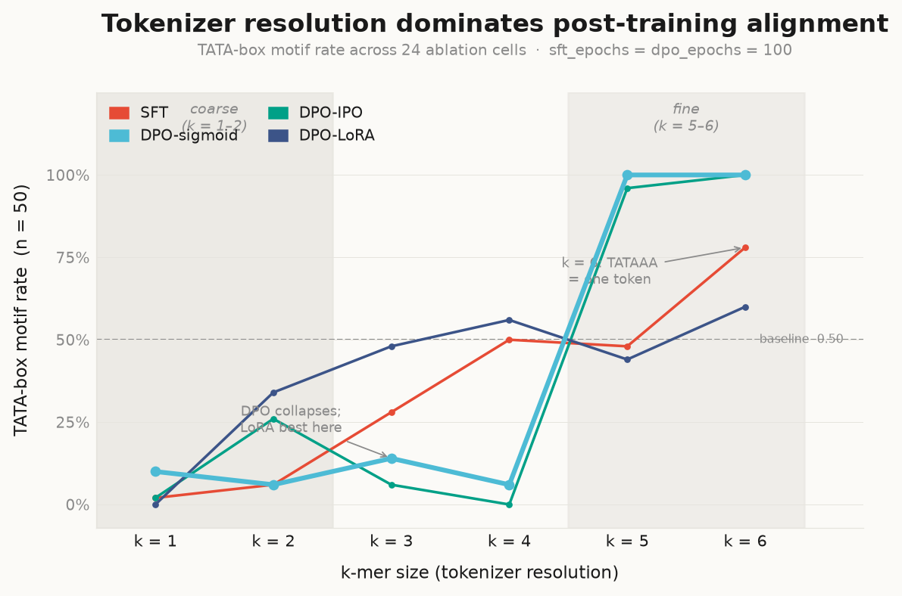
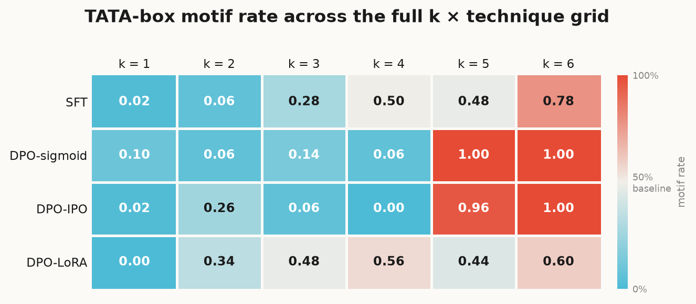
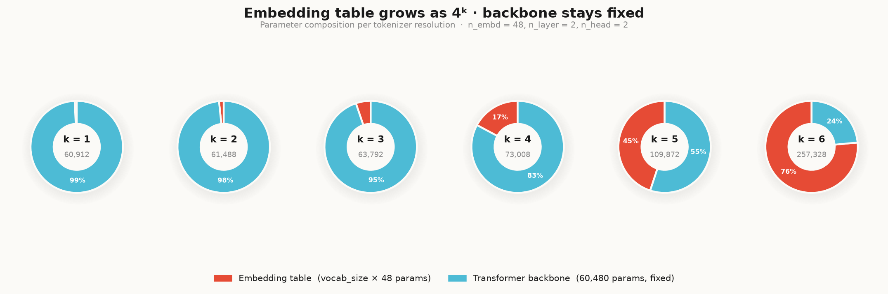
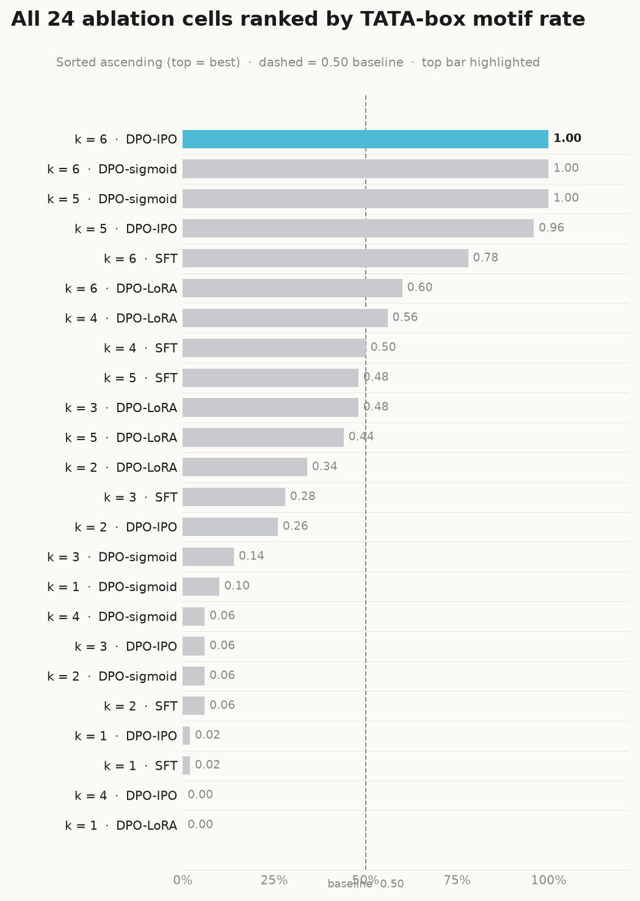

# predicting_TATABOX

A tokenizer x post-training technique ablation grid on a **from-scratch GPT-2
causal LM** that learns to generate synthetic DNA sequences containing a
**TATA-box** promoter motif (`TATAAA`).

The experiment sweeps two axes simultaneously:

- **Tokenizer axis**: the *same* architecture is trained from scratch with
  k-mer tokenizers for every `k` in `1..6`. Vocabulary size is `4**k + 5`
  (4 -> 4,101), so holding the architecture fixed turns "how much does
  tokenizer choice change the model?" into a measurable quantity:
  `total_params` grows ~4x for every increment of `k`, purely from the token
  embedding table. At `k=6` the TATA-box motif (6 bases) collapses into a
  **single vocabulary token** -- a qualitatively different regime from `k<6`.
- **Post-training technique axis**: for each `k`, one SFT-trained checkpoint
  is the shared starting point for four techniques:
  - `sft` -- baseline, no further training.
  - `dpo-sigmoid` -- classic [DPO](https://arxiv.org/abs/2305.18290) (`trl.DPOTrainer`, `loss_type="sigmoid"`).
  - `dpo-ipo` -- [IPO](https://arxiv.org/abs/2310.12036) loss variant (`loss_type="ipo"`).
  - `dpo-lora` -- DPO with [LoRA](https://arxiv.org/abs/2106.09685) adapters
    on the causal LM's attention projections, instead of full fine-tuning.

That's a 6 x 4 = **24-cell grid**. Every cell reports `vocab_size`,
`total_params`, `trainable_params`/`trainable_pct`, and `motif_rate` (the
fraction of freely generated sequences containing the TATA-box k-mers, vs.
`baseline_motif_rate = 0.5` -- the SFT corpus's motif fraction by
construction).

## Repo layout

```
src/predicting_tatabox/
  data.py        # synthetic DNA corpus: BASES, TATA_BOX, to_kmers, make_examples
  tokenizer.py   # k-mer vocab + WordLevel tokenizer, generic for k=1..6
  dpo.py         # RunConfig, from-scratch GPT-2, SFT, DPO (sigmoid/ipo), LoRA
  ablation.py    # the 6x4 grid runner
  tracking.py    # dependency-free run logging (-> runs/*.json)
scripts/
  run_ablation.py    # CLI: run the grid -> results/tokenizer_technique_ablation.csv
  plot_ablation.py   # CSV -> results/*.png (quick diagnostic plots)
  plot_publication.py  # CSV -> results/fig{1..4}.pdf (Nature/Science visual language)
tests/           # pytest, unit + tiny end-to-end smoke tests (k=1 and k=6 edge cases)
results/         # committed CSV + plots from the full grid run
runs/            # per-run JSON provenance (params, metrics, git SHA, timestamp)
logs/            # terminal output captures (gitignored; use tee convention below)
```

## Setup

```bash
uv venv && uv pip install -e ".[dev]"     # lint/type/test only, no ML deps
uv pip install -e ".[ml]"                  # + torch/transformers/trl/peft/datasets
uv pip install -e ".[viz]"                 # + matplotlib, for plotting results
```

## Running the grid

```bash
# Full 6x4 default grid (n_embd=48, n_layer=2, n_head=2 -- ~61K-257K total params)
# Pipe through tee to keep a terminal log (gitignored)
uv run python scripts/run_ablation.py 2>&1 | tee logs/$(date +%Y%m%d-%H%M%S)-run_ablation.log

# A quick, tiny sanity run
uv run python scripts/run_ablation.py --ks 1 3 6 --n-sft 50 --sft-epochs 5 --dpo-epochs 2

# Diagnostic plots -> results/*.png
uv run python scripts/plot_ablation.py

# Publication-quality figures -> results/fig{1..4}.pdf
uv run python scripts/plot_publication.py
```

## Development

```bash
make check   # ruff (lint+format), mypy --strict, pytest
```

`pytest` runs the full ML-backed test suite once `[ml]` is installed; without
it, those tests are skipped via `pytest.importorskip`.

## Results

Full 24-cell run. Config: `sft_epochs = 100, dpo_epochs = 100, n_sft = 200, n_pref = 100, n_eval = 50`.

**Key finding: k (tokenizer resolution) dominates over post-training technique.**

| k regime | best technique | motif rate | note |
|----------|---------------|------------|------|
| k = 1–2  | none above baseline | ≤ 0.10 | vocab too coarse; all techniques fail |
| k = 3–4  | **DPO-LoRA** | up to 0.56 | full DPO collapses to ~0; LoRA regularizes |
| k = 5–6  | **DPO-sigmoid / DPO-IPO** | up to 1.00 | fine-grained tokens → saturation |

At `k = 6` the TATA-box motif `TATAAA` is a single vocabulary token; SFT alone
reaches 0.78 motif rate. Full DPO achieves 1.00 (100% of generated sequences
contain the motif).

See [`MODEL_CARD.md`](MODEL_CARD.md) for the complete 24-row table and analysis.

### Fig 1 — Motif rate vs tokenizer resolution



### Fig 4 — Ablation grid heatmap (k × technique)



### Fig 2 — Parameter composition (embedding grows as 4ᵏ)



### Fig 3 — All 24 cells ranked by motif rate



> High-resolution PDFs: [`fig1_performance.pdf`](results/fig1_performance.pdf) ·
> [`fig2_param_scale.pdf`](results/fig2_param_scale.pdf) ·
> [`fig3_ranking.pdf`](results/fig3_ranking.pdf) ·
> [`fig4_heatmap.pdf`](results/fig4_heatmap.pdf)
